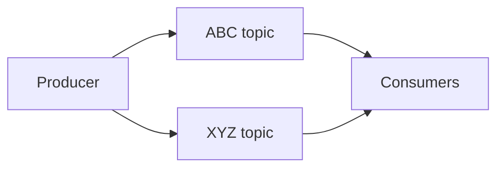
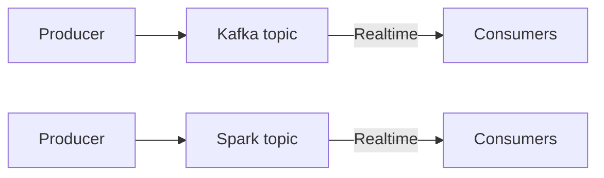

# Week 6: Stream Processing

## Learn Kafka
* https://developer.confluent.io/learn-kafka/data-pipelines/intro/
* https://developer.confluent.io/learn-kafka/kafka-connect/intro/
* https://developer.confluent.io/learn-kafka/ksqldb/intro/

## Code structure
* [Java examples](java)
* [Python examples](python)
* [KSQLD examples](ksqldb)

## Confluent cloud setup
Confluent cloud provides a free 30 days trial for, you can signup [here](https://www.confluent.io/confluent-cloud/tryfree/)

## Introduction to Stream Processing

- [Slides](https://docs.google.com/presentation/d/1bCtdCba8v1HxJ_uMm9pwjRUC-NAMeB-6nOG2ng3KujA/edit?usp=sharing)
- :movie_camera: 6.0.1 [DE Zoomcamp 6.0.1 - Introduction](https://www.youtube.com/watch?v=hfvju3iOIP0)
- :movie_camera: 6.0.2 [DE Zoomcamp 6.0.2 - What is stream processing](https://www.youtube.com/watch?v=WxTxKGcfA-k)

### 6.2 What is stream processing

## Introduction to Kafka

- :movie_camera: 6.3 [DE Zoomcamp 6.3 - What is kafka?](https://www.youtube.com/watch?v=zPLZUDPi4AY)
- :movie_camera: 6.4 [DE Zoomcamp 6.4 - Confluent cloud](https://www.youtube.com/watch?v=ZnEZFEYKppw)
- :movie_camera: 6.5 [DE Zoomcamp 6.5 - Kafka producer consumer](https://www.youtube.com/watch?v=aegTuyxX7Yg)

### 6.3 What is Kafka?

* Events - topic
  ```mermaid
  flowchart TD;
      A[Events] --> B[Topic 1];
      A --> C[Topic 2];
      A --> D[Topic 3];
      A --> E[Topic 4];
      A --> F[Topic 5];
      A --> G[Topic 6];
      A --> H[Topic 7];
  ```
  - Logs: how to stored data inside of topic
  - Messages: key, value and timestamp
  - Topics: Robustness and Flexibility, Scalability
  - CDC: change data connect
### 6.4 Confluent cloud
### 6.5 kafka producer consumer
* https://archive.apache.org/dist/kafka/3.5.1/
  ```bash
  wget https://archive.apache.org/dist/kafka/3.5.1/kafka_2.13-3.5.1.tgz
  tar -xzf kafka_2.13-3.5.1.tgz

  # set env
  nano .bashrc
  export KAFKA_HOME="${HOME}/kafka/kafka_2.13-3.5.1"
  export PATH="${KAFKA_HOME}/bin:${PATH}"
  source .bashrc
  logout

  # Start ZooKeeper
  cd $KAFKA_HOME
  $KAFKA_HOME/bin/zookeeper-server-start.sh $KAFKA_HOME/config/zookeeper.properties
    
  # Start the Kafka broker service
  cd $KAFKA_HOME
  $KAFKA_HOME/bin/kafka-server-start.sh $KAFKA_HOME/config/server.properties
    
  # Create a topic
  cd $KAFKA_HOME
  $KAFKA_HOME/bin/kafka-topics.sh --create --topic news --bootstrap-server localhost:9092
    
  # Start Producer
  cd $KAFKA_HOME
  $KAFKA_HOME/bin/kafka-console-producer.sh --topic news --bootstrap-server localhost:9092

  # Once the producer starts, and you get the '>' prompt, type any text message and press enter.
  # Or you can copy the text below and paste. The below text sends three messages to kafka.
  Good morning
  Good day
  Enjoy the Kafka lab
    
  # Start Consumer
  cd $KAFKA_HOME
  $KAFKA_HOME/bin/kafka-console-consumer.sh --topic news --from-beginning --bootstrap-server localhost:9092
  ```
* Explore Kafka directories.
  * Kafka home folder has the below 3 sub directories.
    - bin -	shell scripts to control kafka and zookeeper
    - config - configuration files
    - logs - log files for kafka and zookeeper
  * Kafka uses the directory /tmp/kakfa-logs to store the messages.
  * Explore the folder news-0 inside /tmp/kakfa-logs.

## Kafka Configuration

- :movie_camera: 6.6 [DE Zoomcamp 6.6 - Kafka configuration](https://www.youtube.com/watch?v=SXQtWyRpMKs)
- [Kafka Configuration Reference](https://docs.confluent.io/platform/current/installation/configuration/)

### 6.6 Kafka configuration

## Kafka Streams

- [Slides](https://docs.google.com/presentation/d/1fVi9sFa7fL2ZW3ynS5MAZm0bRSZ4jO10fymPmrfTUjE/edit?usp=sharing)
- [Streams Concepts](https://docs.confluent.io/platform/current/streams/concepts.html)
- :movie_camera: 6.7 [DE Zoomcamp 6.7 - Kafka streams basics](https://www.youtube.com/watch?v=dUyA_63eRb0)
- :movie_camera: 6.8 [DE Zoomcamp 6.8 - Kafka stream join](https://www.youtube.com/watch?v=NcpKlujh34Y)
- :movie_camera: 6.9 [DE Zoomcamp 6.9 - Kafka stream testing](https://www.youtube.com/watch?v=TNx5rmLY8Pk)
- :movie_camera: 6.10 [DE Zoomcamp 6.10 - Kafka stream windowing](https://www.youtube.com/watch?v=r1OuLdwxbRc)
- :movie_camera: 6.11 [DE Zoomcamp 6.11 - Kafka ksqldb & Connect](https://www.youtube.com/watch?v=DziQ4a4tn9Y)
- :movie_camera: 6.12 [DE Zoomcamp 6.12 - Kafka Schema registry](https://www.youtube.com/watch?v=tBY_hBuyzwI)

### 6.7 Kafka stream basics
### 6.8 Kafka stream join
### 6.9 Kafka stream testing
### 6.10 Kafka stream windowing
### 6.11 Kafka ksqldb & Connect
### 6.12 Kafka Schema registry

## Faust - Python Stream Processing


- [Faust Documentation](https://faust.readthedocs.io/en/latest/index.html)
- [Faust vs Kafka Streams](https://faust.readthedocs.io/en/latest/playbooks/vskafka.html)

## Pyspark - Structured Streaming
Please follow the steps described under [pyspark-streaming](python/streams-example/pyspark/README.md)
- :movie_camera: 6.13 [DE Zoomcamp 6.13 - Kafka Streaming with Python](https://www.youtube.com/watch?v=Y76Ez_fIvtk)
- :movie_camera: 6.14 [DE Zoomcamp 6.14 - Pyspark Structured Streaming](https://www.youtube.com/watch?v=5hRJ8-6Fpyk)

### 6.13 Kafka Streaming with Python
### 6.14 Pyspark Structured Streaming

## Kafka Streams with JVM library

- [Confluent Kafka Streams](https://kafka.apache.org/documentation/streams/)
- [Scala Example](https://github.com/AnkushKhanna/kafka-helper/tree/master/src/main/scala/kafka/schematest)

## KSQL and ksqlDB

- [Introducing KSQL: Streaming SQL for Apache Kafka](https://www.confluent.io/blog/ksql-streaming-sql-for-apache-kafka/)
- [ksqlDB](https://ksqldb.io/)

## Kafka Connect

- [Making Sense of Stream Data](https://medium.com/analytics-vidhya/making-sense-of-stream-data-b74c1252a8f5)

## Docker

### Starting cluster

## Command line for Kafka

### Create topic

```bash
./bin/kafka-topics.sh --create --topic demo_1 --bootstrap-server localhost:9092 --partitions 2
```

## Homework

[Form](https://forms.gle/rK7268U92mHJBpmW7)

The homework is mostly theoretical. In the last question you have to provide working code link, please keep in mind that this
question is not scored.

Deadline: 13 March 2023, 22:00 CET


## Community notes

Did you take notes? You can share them here.

* [Notes by Alvaro Navas](https://github.com/ziritrion/dataeng-zoomcamp/blob/main/notes/6_streaming.md )
* [Marcos Torregrosa's blog (spanish)](https://www.n4gash.com/2023/data-engineering-zoomcamp-semana-6-stream-processing/)
* Add your notes here (above this line)
